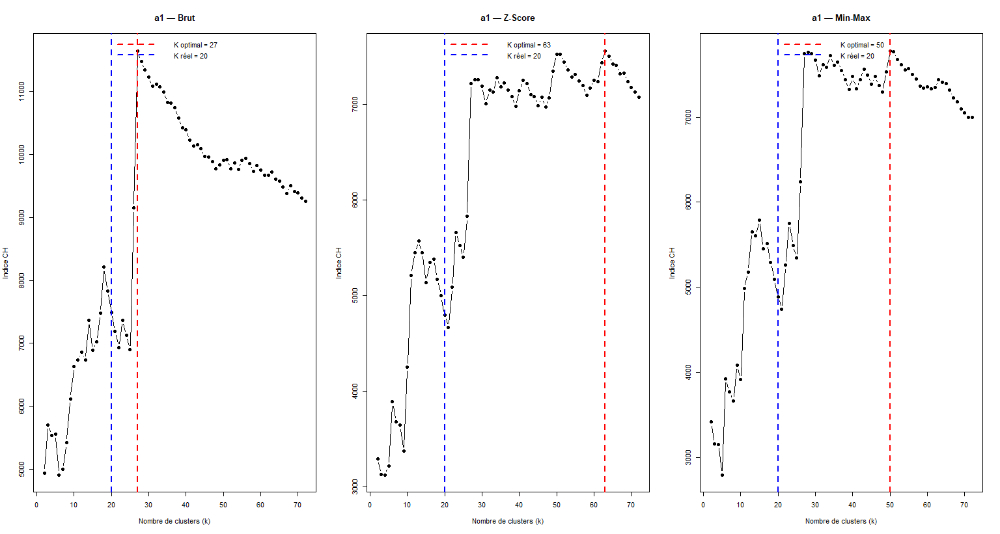
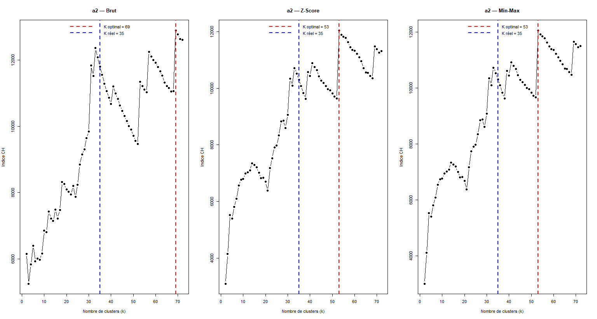
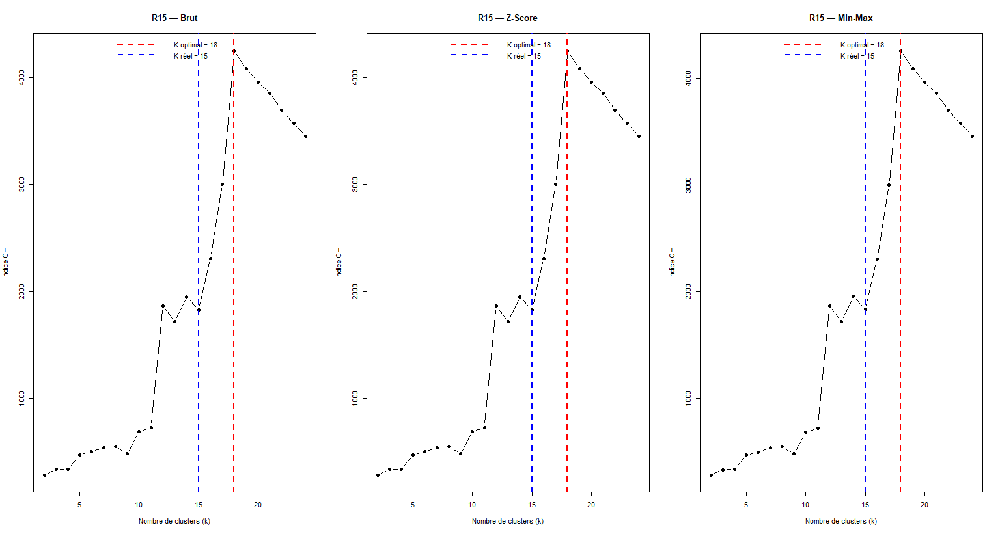
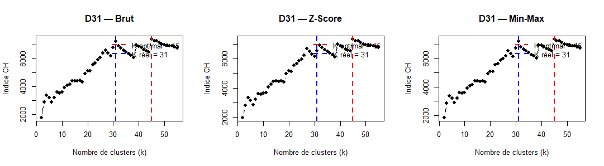
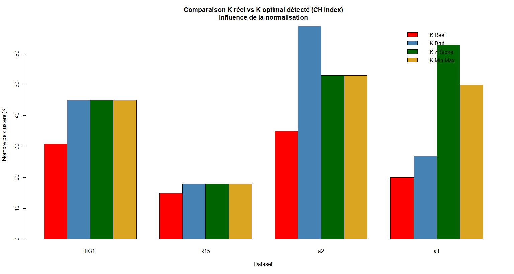

# Calinski-Harabasz Index — Cluster Detection in R

> Course Project — EIDIA · UEMF · Semester 6 · Unsupervised Learning

---

## Datasets

| Dataset | Real k | Description |
|---------|--------|-------------|
| A1 | 20 | Gaussian clusters with partial overlaps |
| A2 | 35 | Gaussian clusters with variable sizes |
| R15 | 15 | Well-separated spherical clusters |
| D31 | 31 | Dense Gaussian overlapping clusters |

---

## Calinski-Harabasz Index

CH(k) = [ B(k) / (k−1) ] / [ W(k) / (n−k) ]

- B(k) : inter-cluster dispersion
- W(k) : intra-cluster dispersion
- k : number of clusters
- n : number of observations

The k that **maximizes** CH(k) is the optimal number of clusters.

---

## Results — Raw Data

| Dataset | Real k | Detected k | Error |
|---------|--------|------------|-------|
| A1 | 20 | 27 | 35.0% |
| A2 | 35 | 69 | 97.1% |
| R15 | 15 | 18 | 20.0% |
| D31 | 31 | 45 | 45.2% |

---

## Results — Z-Score Normalization

| Dataset | Real k | Detected k | Error |
|---------|--------|------------|-------|
| A1 | 20 | 63 | 215.0% |
| A2 | 35 | 53 | 51.4% |
| R15 | 15 | 18 | 20.0% |
| D31 | 31 | 45 | 45.2% |

---

## Results — Min-Max Normalization

| Dataset | Real k | Detected k | Error |
|---------|--------|------------|-------|
| A1 | 20 | 50 | 150.0% |
| A2 | 35 | 53 | 51.4% |
| R15 | 15 | 18 | 20.0% |
| D31 | 31 | 45 | 45.2% |

---

## Comparison

| Condition | Mean Error |
|-----------|------------|
| Raw | 49.3% |
| Z-Score | 82.9% |
| Min-Max | 66.7% |

Raw data gives the best results on these isotropic synthetic datasets. Normalization does not help and can degrade performance (A1 with Z-Score: 35% → 215%).

---

## Strengths and Limitations

**Strengths**
- Simple to interpret — maximize one value
- Low computational cost
- Works well on compact spherical clusters

**Limitations**
- Overestimates k when clusters overlap
- Normalization is counter-productive on isotropic data
- Fails on non-convex structures

---

## Author

**Aya Driouche** — UEMF · EIDIA · 2025–2026
